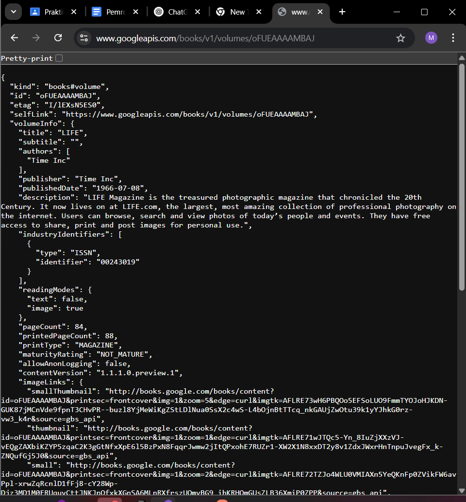
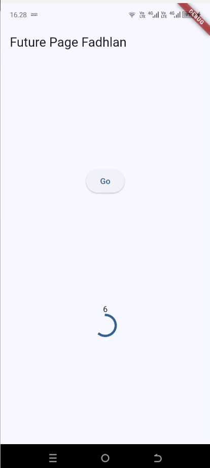
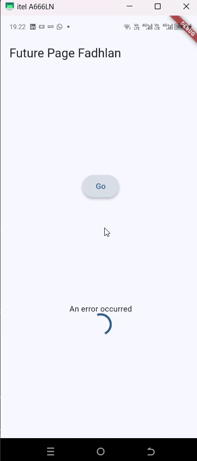

# Books

A new Flutter project.

## Getting Started

This project is a starting point for a Flutter application.

A few resources to get you started if this is your first Flutter project:

- [Lab: Write your first Flutter app](https://docs.flutter.dev/get-started/codelab)
- [Cookbook: Useful Flutter samples](https://docs.flutter.dev/cookbook)

For help getting started with Flutter development, view the  
[online documentation](https://docs.flutter.dev/), which offers tutorials,  
samples, guidance on mobile development, and a full API reference.

---

## Display

### Praktikum 1

#### Soal 1

#### Soal 2

#### Soal 3
- `substring` digunakan untuk mengambil sebagian isi string, yaitu 450 karakter pertama dari hasil response (`value.body`). Tujuannya untuk menghindari tampilan string terlalu panjang atau hanya ingin menampilkan cuplikan (preview).
- `catchError()` digunakan untuk menangani error jika proses `getData()` gagal, misalnya karena koneksi internet bermasalah, server tidak merespon, dan sebagainya.

    

---

### Praktikum 2

#### Soal 4
- Ketiga fungsi pada Langkah 1 merupakan fungsi asynchronous yang masing-masing menunda eksekusi selama 3 detik. Setelah menunda selama waktu yang telah ditentukan, fungsi mengembalikan nilai 1, 2, dan 3 dari masing-masing fungsi.
- Pada Langkah ke-2, dibuat fungsi `count()` untuk memanggil ketiga fungsi satu per satu menggunakan `async/await`. Setelah nilai didapat, ketiganya dijumlahkan hingga menghasilkan nilai 6. Lalu, `setState()` dipanggil untuk mengubah UI dan menampilkan hasilnya.

    

---

### Praktikum 3

#### Soal 5
- `Completer` merupakan objek dalam `Future` yang cara kerjanya mirip dengan `async/await`. Bedanya ada pada penyelesaian akhir: `Completer` harus diselesaikan secara manual dengan memanggil `completer.complete()`, sedangkan `async/await` cukup menggunakan `return`.

    

### Soal 6
- try-catch adalah mekanisme penanganan error (error handling) dalam pemrograman.
Kode yang berada di dalam blok try akan dicoba dijalankan.
Jika tidak ada error, maka semuanya berjalan normal.
Tapi kalau terjadi error saat eksekusi, program akan langsung "lompat" ke blok catch, dan kode di dalam catch akan dijalankan sebagai respon atas error tersebut.

   

---

### Praktikum 4
#### Soal 7
- Hasil  
   

#### Soal 8
- Langkah 1 (FutureGroup) perlu import dari 'asnync' package, bisa dinamis karena add per-item, perlu menambahkan add + close, fleksibel dan cocok untuk looping
- Langkah 4 (Future.wait), itu Native (langsung dri dart), Fixed/ list di awal, langsung pass list, simpel dan cepat.

---

### Praktikum 5
#### Soal 9

#### Soal 10

