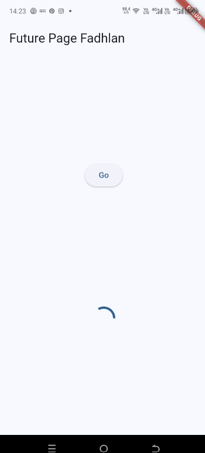
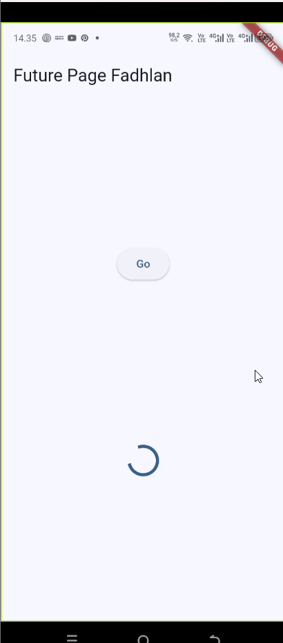

# books

A new Flutter project.

## Getting Started

This project is a starting point for a Flutter application.

A few resources to get you started if this is your first Flutter project:

- [Lab: Write your first Flutter app](https://docs.flutter.dev/get-started/codelab)
- [Cookbook: Useful Flutter samples](https://docs.flutter.dev/cookbook)

For help getting started with Flutter development, view the
[online documentation](https://docs.flutter.dev/), which offers tutorials,
samples, guidance on mobile development, and a full API reference.

## Display 
### Praktikum 1
<!-- Soal 1 -->
<h4>Soal 1</h4>

<!-- Soal 2 -->
<h4>Soal 2</h4>

<!-- Soal 3 -->
<h4>Soal 3</h4>

<ul>
<li>Substring digunakan untuk mengambil sebagian isi string, yaitu 450 karakter pertama dari hasil response (value.body). Tujuannya untuk menghindari tampilan string terlalu panjang atau hanya ingin menampilkan cuplikan (preview)</li>
<li>Catcherror(), digunakan untuk menangani error jika proses "getData()" gagal, entah dari koneksi internet, server tidak meresppon, dll.
</li>
<ul>

<!-- Soal 4 -->
<h4>Soal 4</h4>

<ul>
<li>Ketiga Fungsi pada Langkah 1 merupakan fungsi asynchronous yg masing-masing menunda eksekusi selama 3 detik. Setelah menunda selama waktu yg telah ditentukan, fungsi mengembalikan nilai 1, 2, 3 dari masing-masing fungsi.</li>
<li>Pada Langkah ke 2, membuat fugsi count() untuk memanggil ketiga fungsi satu persatu denggan async/await. setelah nilai didapat, ketiganya dijumlahkan hingga menghasilkan nilai 6. Lalu, setstate() dipanggil untuk mengubah UI dan menampilkan hasilnya
</li>
<ul>

